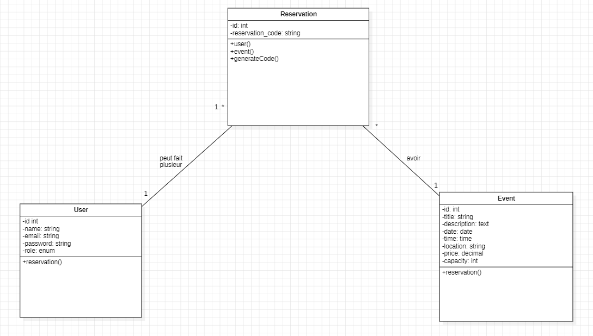
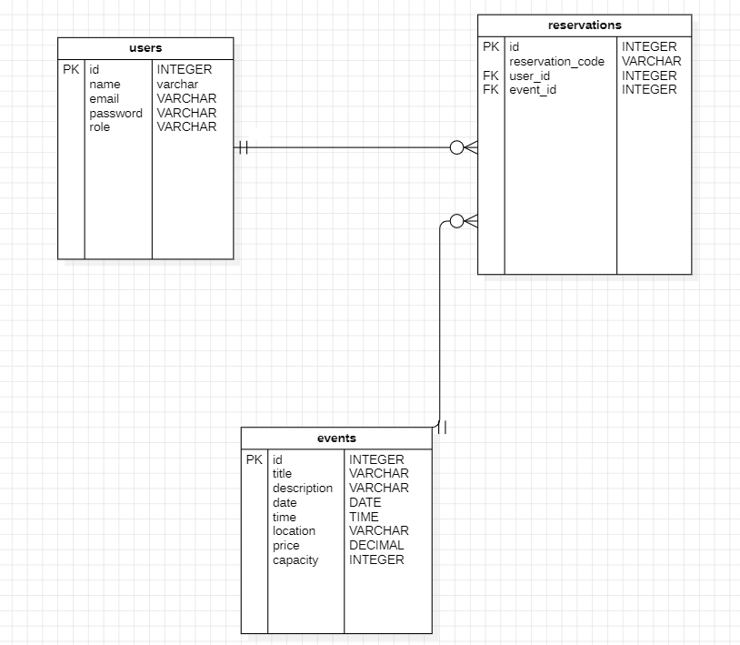
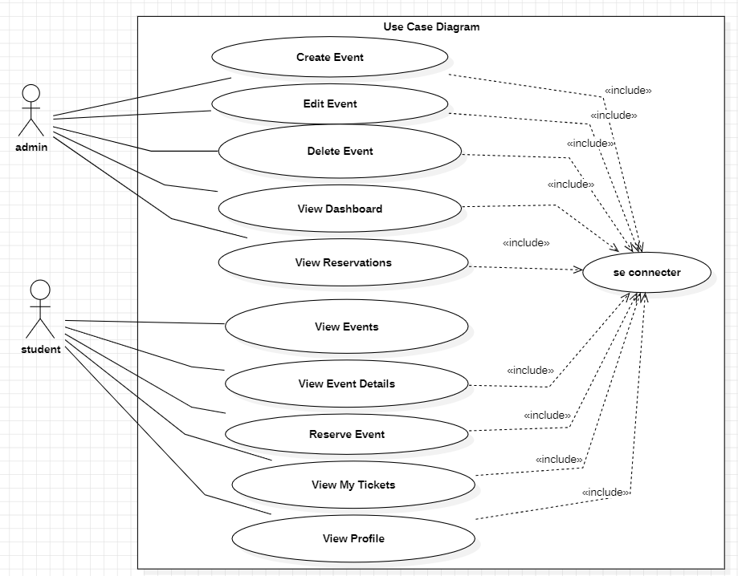

# 🎉 BDE Events

A Laravel-based web application that allows the Student Union (BDE) to manage campus events while enabling students to reserve seats and receive a digital event pass.

---

## 📌 Overview

**BDE Events** is a centralized platform designed to simplify the organization of university events.

The application provides an administration dashboard for the BDE to create and manage events, while students can browse events, reserve a seat, and access their digital tickets from their personal space.

---

## ✨ Features

### 👨‍💼 Administrator (BDE)

- Secure authentication
- Admin dashboard
- Create, update and delete events
- Monitor event capacity
- View reservations
- Manage event information

### 👨‍🎓 Student

- Register and log in
- Browse available events
- View event details
- Reserve a seat
- Prevent duplicate reservations
- Access personal digital tickets

---

## 🛠️ Built With

- Laravel 12
- PHP 8.2+
- MySQL
- Blade
- Bootstrap 5
- Laravel Breeze
- Eloquent ORM
- Git & GitHub

---

## 📂 Project Structure

```text
app/
├── Http/
│   ├── Controllers/
│   │   ├── Admin/
│   │   └── ReservationController.php
│   └── Middleware/
│       └── IsAdmin.php
│
├── Models/
│   ├── User.php
│   ├── Event.php
│   └── Reservation.php
│
resources/
│   └── views/
│       ├── admin/
│       ├── student/
│       └── events/
│
routes/
└── web.php
```

---

## 🗄️ Database Schema

### Users

| Column   | Type                      |
| -------- | ------------------------- |
| id       | bigint                    |
| name     | string                    |
| email    | string                    |
| password | string                    |
| role     | enum (`admin`, `student`) |

### Events

| Column      | Type    |
| ----------- | ------- |
| id          | bigint  |
| title       | string  |
| description | text    |
| date        | date    |
| time        | time    |
| location    | string  |
| price       | decimal |
| capacity    | integer |

### Reservations

| Column           | Type        |
| ---------------- | ----------- |
| id               | bigint      |
| user_id          | Foreign Key |
| event_id         | Foreign Key |
| reservation_code | string      |

---

## 🔗 Entity Relationship

```text
User
 │
 │ 1
 ▼
Reservation
 ▲
 │ *
 │
Event
```

---

## 👥 User Roles

### Admin

- Manage events
- Access the administration dashboard
- Monitor reservations
- Track event capacity

### Student

- Browse events
- Reserve a seat
- View personal tickets

---

## 🔒 Security

- Authentication using Laravel Breeze
- Role-based authorization
- Custom `IsAdmin` middleware
- CSRF protection
- Server-side validation
- Protected admin routes

---

## 🚀 Installation

Clone the repository

```bash
git clone <repository-url>
```

Go to the project directory

```bash
cd BDE-Events
```

Install PHP dependencies

```bash
composer install
```

Install Node dependencies

```bash
npm install
```

Create the environment file

```bash
cp .env.example .env
```

Generate the application key

```bash
php artisan key:generate
```

Configure your database in the `.env` file.

Run migrations

```bash
php artisan migrate
```

Start the development server

```bash
npm run dev

php artisan serve
```

---

## 📍 Main Routes

### Public

| Method | Route           |
| ------ | --------------- |
| GET    | /               |
| GET    | /events         |
| GET    | /events/{event} |

### Student

| Method | Route                   |
| ------ | ----------------------- |
| GET    | /dashboard              |
| POST   | /events/{event}/reserve |
| GET    | /my-tickets             |

### Admin

| Method   | Route            |
| -------- | ---------------- |
| GET      | /admin/dashboard |
| Resource | /admin/events    |

---

## 📸 Screenshots

Screenshots will be added after the application is completed.

- Home Page
- Event Details
- Admin Dashboard
- Reservation Page
- Digital Ticket

---

## 📑 Documentation

The project documentation includes:

- Use Case Diagram
- UML Class Diagram
- Entity Relationship Diagram (ERD)
- Project Presentation
- GitHub README

---

## 🚧 Future Improvements

- QR Code generation
- PDF ticket download
- Email confirmation
- Event categories
- Search and filtering
- Reservation cancellation
- Event statistics dashboard

---

## 👨‍💻 Author

**Ayoub Sofi**

Full Stack Web Developer

---

## 📄 License

This project was developed for educational purposes.

## all diagram

  
