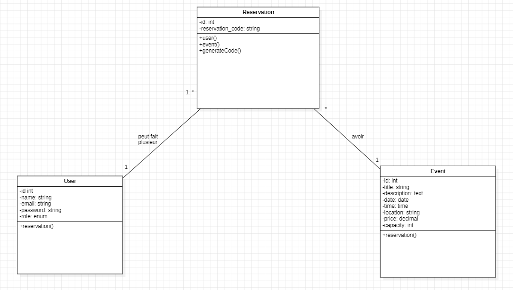
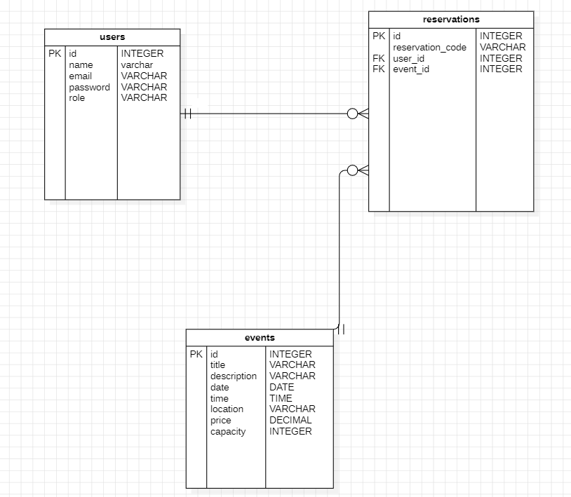
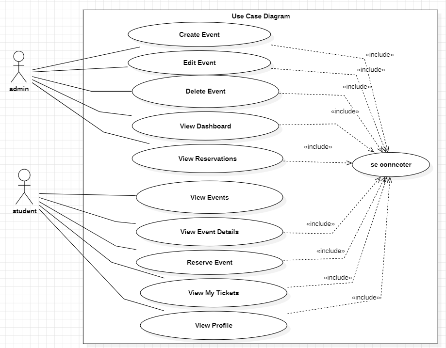

# 🎉 BDE Events – Plateforme de gestion et de réservation d'événements universitaires

## 📌 Présentation du projet

**BDE Events** est une application web développée avec **Laravel** permettant au Bureau des Étudiants (BDE) d'organiser et de gérer les événements du campus.

Elle s'adresse principalement aux administrateurs du BDE et aux étudiants souhaitant consulter les événements disponibles, réserver une place et récupérer leur billet numérique.

Son objectif principal est de simplifier l'organisation des événements universitaires, d'automatiser la gestion des réservations et d'améliorer l'expérience des étudiants.

---

# ❓ Problématique

L'organisation des événements étudiants est souvent réalisée de manière manuelle, ce qui complique la gestion des inscriptions, le suivi des places disponibles et la distribution des billets.

La solution proposée permet au BDE de gérer facilement les événements tandis que les étudiants peuvent réserver une place en ligne, consulter leurs réservations et accéder à leurs billets numériques depuis leur espace personnel.

---

# ✨ Fonctionnalités principales

## Administrateur

- Créer un événement
- Modifier un événement
- Supprimer un événement
- Gérer les informations des événements
- Consulter les réservations
- Suivre la capacité des événements

## Étudiant

- Créer un compte
- Se connecter à son espace
- Consulter les événements disponibles
- Voir les détails d'un événement
- Réserver une place
- Consulter ses billets numériques

---

# 🛠️ Technologies utilisées

| Technologie    | Utilisation dans le projet                       |
| -------------- | ------------------------------------------------ |
| Laravel 12     | Développement du backend avec l'architecture MVC |
| PHP 8.2+       | Développement de la logique métier               |
| MySQL          | Stockage des données                             |
| Blade          | Création des interfaces utilisateur              |
| Bootstrap 5    | Mise en page responsive                          |
| Laravel Breeze | Authentification des utilisateurs                |
| Eloquent ORM   | Gestion des relations avec la base de données    |
| Git            | Gestion des versions                             |
| GitHub         | Hébergement du code source                       |

---

# 📂 Structure du projet

```text
app/
├── Http/
│   ├── Controllers/
│   │   ├── Admin/
│   │   └── ReservationController.php
│   └── Middleware/
│       └── IsAdmin.php
│
├── Models/
│   ├── User.php
│   ├── Event.php
│   └── Reservation.php
│
resources/
│   └── views/
│       ├── admin/
│       ├── student/
│       └── events/
│
routes/
└── web.php
```

---

# 🗄️ Base de données

## Users

| Colonne  | Type                 |
| -------- | -------------------- |
| id       | bigint               |
| name     | string               |
| email    | string               |
| password | string               |
| role     | enum(admin, student) |

## Events

| Colonne     | Type    |
| ----------- | ------- |
| id          | bigint  |
| title       | string  |
| description | text    |
| date        | date    |
| time        | time    |
| location    | string  |
| price       | decimal |
| capacity    | integer |

## Reservations

| Colonne          | Type        |
| ---------------- | ----------- |
| id               | bigint      |
| user_id          | Foreign Key |
| event_id         | Foreign Key |
| reservation_code | string      |

---

# 🔗 Relation entre les entités

```text
User
 │
 │1
 ▼
Reservation
 ▲
 │*
 │
Event
```

---

# 👥 Rôles des utilisateurs

## Administrateur

- Gérer les événements
- Accéder au tableau de bord
- Consulter les réservations
- Suivre les capacités des événements

## Étudiant

- Consulter les événements
- Réserver une place
- Accéder à ses billets

---

# 🔒 Sécurité

Le projet utilise plusieurs mécanismes de sécurité :

- Authentification avec Laravel Breeze
- Middleware personnalisé IsAdmin
- Protection CSRF
- Validation côté serveur
- Contrôle des accès selon le rôle utilisateur

---

# 🚀 Installation et lancement

## 1. Prérequis

Avant de lancer le projet, vous devez disposer de :

- PHP 8.2 ou supérieur
- Composer
- Node.js
- npm
- MySQL
- Git

---

## 2. Cloner le dépôt

```bash
git clone https://github.com/ayoubsofi21/BDE-Events.git
```

---

## 3. Ouvrir le dossier

```bash
cd BDE-Events
```

---

## 4. Installer les dépendances

Installer les dépendances PHP

```bash
composer install
```

Installer les dépendances JavaScript

```bash
npm install
```

---

## 5. Configurer le projet

Créer le fichier d'environnement

```bash
cp .env.example .env
```

Générer la clé Laravel

```bash
php artisan key:generate
```

Configurer la base de données dans le fichier `.env`

```env
APP_NAME=BDE_EVENTS

DB_CONNECTION=mysql

DB_DATABASE=bde_events

DB_USERNAME=votre_utilisateur

DB_PASSWORD=votre_mot_de_passe
```

---

## 6. Exécuter les migrations

```bash
php artisan migrate
```

---

## 7. Lancer le projet

Lancer Vite

```bash
npm run dev
```

Puis lancer Laravel

```bash
php artisan serve
```

---

## 8. Ouvrir le projet

Le projet est accessible à l'adresse suivante :

```
http://127.0.0.1:8000
```

---

# 📍 Routes principales

## Publiques

| Méthode | Route           |
| ------- | --------------- |
| GET     | /               |
| GET     | /events         |
| GET     | /events/{event} |

## Étudiant

| Méthode | Route                   |
| ------- | ----------------------- |
| GET     | /dashboard              |
| POST    | /events/{event}/reserve |
| GET     | /my-tickets             |

## Administrateur

| Méthode  | Route            |
| -------- | ---------------- |
| GET      | /admin/dashboard |
| Resource | /admin/events    |

---

## 🐳 Dockerisation

Le projet est containerisé afin de permettre l'exécution de
l'environnement complet sans installer manuellement toutes les
dépendances du backend et du frontend.

### Services

- API Laravel
- Frontend React
- Nginx
- MySQL

### Lancer le projet

docker compose up --build

## 👨‍💻 Travail réalisé pendant le brief

Durant le développement du projet, j'ai travaillé sur plusieurs parties
de l'application :

- Développement de l'API REST Laravel
- Mise en place de l'authentification
- Gestion des rôles admin et étudiant
- Développement du frontend avec React
- Mise en place de l'AuthContext
- Gestion du token utilisateur
- Création des routes React protégées
- Développement de la logique de connexion et d'inscription
- Développement de la logique de création d'événements côté administrateur
- Communication entre React et l'API Laravel avec Axios
- Mise en place de Docker pour le backend et le frontend
- Configuration de Nginx pour servir l'application React
- Configuration de Docker Compose
- Tests et résolution des problèmes CORS
- Préparation des images Docker pour DockerHub

# 📸 Captures d'écran

## Capture 1

### Page d'accueil

```md

```

Cette capture montre la liste des événements disponibles pour les étudiants.

---

## Capture 2

### Tableau de bord Administrateur

```md

```

Cette capture montre l'espace d'administration permettant de gérer les événements.

---

## Capture 3

### Billet numérique

```md

```

Cette capture montre le billet numérique généré après une réservation.

---

# 👨‍💻 Contribution personnelle

Ce projet a été réalisé individuellement.

Ma contribution principale a porté sur :

- La conception de la base de données
- Le développement du backend Laravel
- La création des interfaces Blade
- La mise en place de l'authentification
- Le développement du tableau de bord administrateur
- La gestion des réservations
- Les tests et la correction des erreurs

---

# ⚠️ Difficultés rencontrées

## Difficulté 1

### Problème rencontré

Empêcher un étudiant de réserver plusieurs fois le même événement.

### Recherches / Tests

J'ai étudié les relations Eloquent et testé plusieurs requêtes SQL afin de vérifier l'existence d'une réservation avant son enregistrement.

### Solution

J'ai ajouté une vérification avant la création d'une réservation pour empêcher les doublons.

### Ce que j'ai appris

J'ai appris à sécuriser la logique métier avec Laravel et Eloquent.

---

## Difficulté 2

### Problème rencontré

Empêcher les réservations lorsque la capacité maximale d'un événement est atteinte.

### Recherches / Tests

J'ai comparé le nombre de réservations existantes avec la capacité de l'événement.

### Solution

J'ai ajouté un contrôle avant chaque réservation afin de vérifier le nombre de places restantes.

### Ce que j'ai appris

Cette difficulté m'a permis de mieux comprendre les règles métier et leur implémentation dans Laravel.

---

# 🚧 Améliorations possibles

Dans une prochaine version, je pourrais :

- Ajouter la génération d'un QR Code pour chaque billet
- Permettre le téléchargement du billet en PDF
- Envoyer une confirmation par e-mail
- Ajouter un système de recherche et de filtres
- Intégrer les catégories d'événements
- Développer un tableau de bord statistique
- Ajouter l'annulation d'une réservation
- Intégrer un système de paiement en ligne

Ces améliorations permettraient de rendre la plateforme plus complète, plus sécurisée et plus adaptée à une utilisation réelle.

---

# 📚 Documentation

Le projet comprend également :

- Diagramme de cas d'utilisation (Use Case Diagram)
- Diagramme de classes UML
- Diagramme Entité-Relation (ERD)
- Présentation du projet
- Documentation GitHub (README)

---

# 📊 Diagrammes

## Diagramme de classes



---

## Diagramme Entité-Relation (ERD)



---

## Diagramme de cas d'utilisation



---

# 👨‍💻 Auteur

**Ayoub Sofi**

Développeur Full Stack Junior

GitHub : https://github.com/ayoubsofi21

LinkedIn : https://www.linkedin.com/in/ayoub-sofi-72895a290/

Portfolio : https://ayoubsofi.dev

---

# 📄 Licence

Ce projet a été réalisé dans un cadre pédagogique à des fins d'apprentissage.

---

# ✅ Checklist finale

- [x] Nom du projet clair
- [x] Présentation complète
- [x] Public cible identifié
- [x] Problématique expliquée
- [x] Fonctionnalités détaillées
- [x] Technologies expliquées
- [x] Installation documentée
- [x] Captures d'écran prévues
- [x] Contribution personnelle précisée
- [x] Difficultés rencontrées expliquées
- [x] Améliorations proposées
- [x] Diagrammes UML inclus

---

# ✔ Validation

Une personne découvrant ce dépôt peut comprendre :

- le contexte du projet ;
- les utilisateurs concernés ;
- les fonctionnalités principales ;
- les technologies utilisées ;
- la manière d'installer et d'exécuter le projet ;
- les difficultés rencontrées ;
- les améliorations envisagées.
